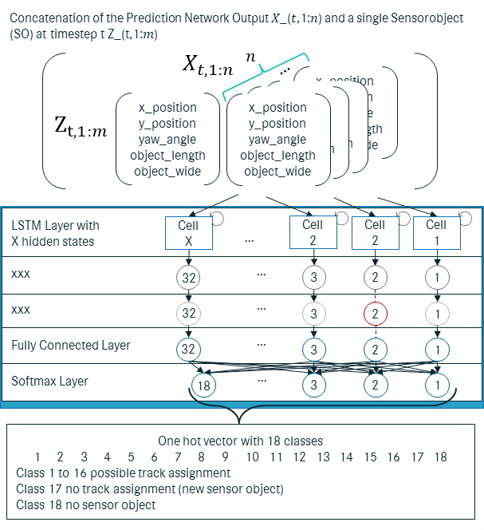
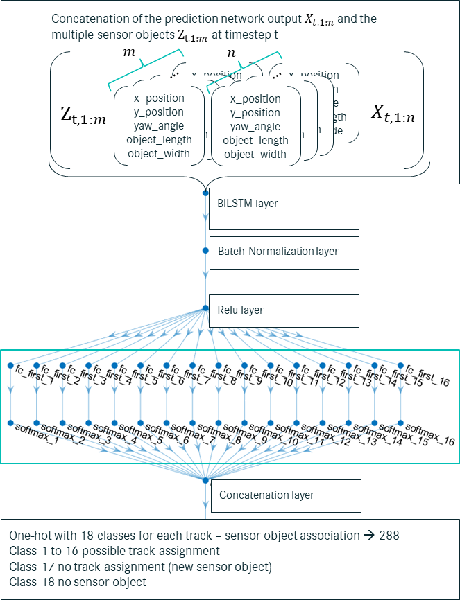

# Multi-object tracking (MOT) without dynamic models and hard association metrics
Authors: Christian Alexander Holz, Christian Bader, Matthias Drüppel

## Description 
Creating and managing the paper.

## Figures
### Schematic representation of the two integrated networks in a tracking-by-detection (TbD) framework.

### Schematic representation of the generic single prediction network (SPENT) structure.

### Schematic representation of the generic single association network (SANT) structure.

### Schematic representation of the generic multi association network (MANTa) structure.
